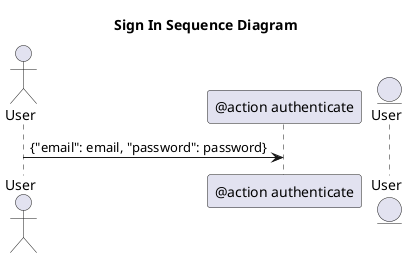

# Medium

You may see the overall process on the diagram below

## 1

## 2

```puml
@startuml sign_in_sequence  
  
title "Sign In Sequence Diagram"  
  
actor User  
participant "@action authenticate" as authenticate
entity User as UserModel  
  
User -> authenticate: {"email": email, "password": password}
```